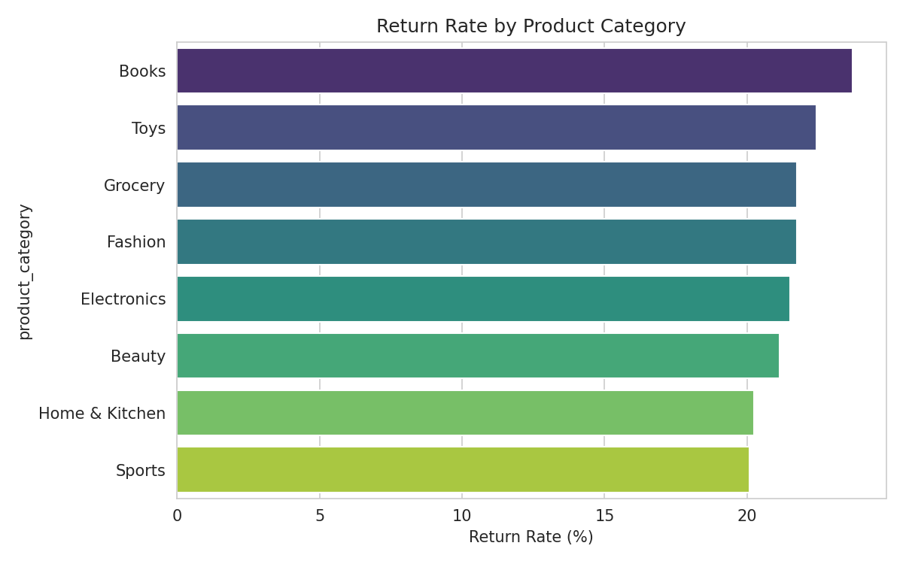
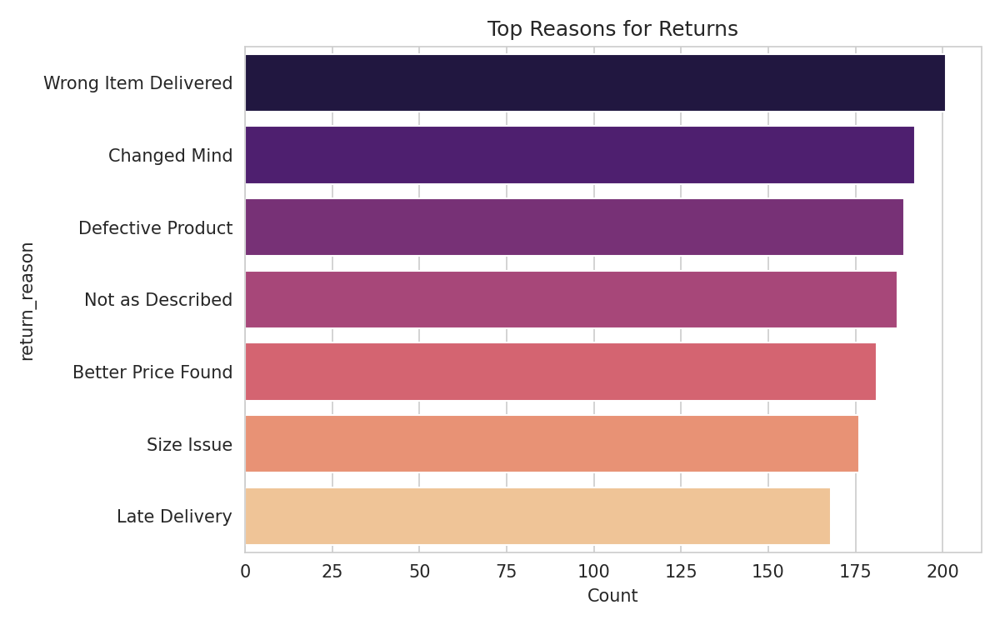
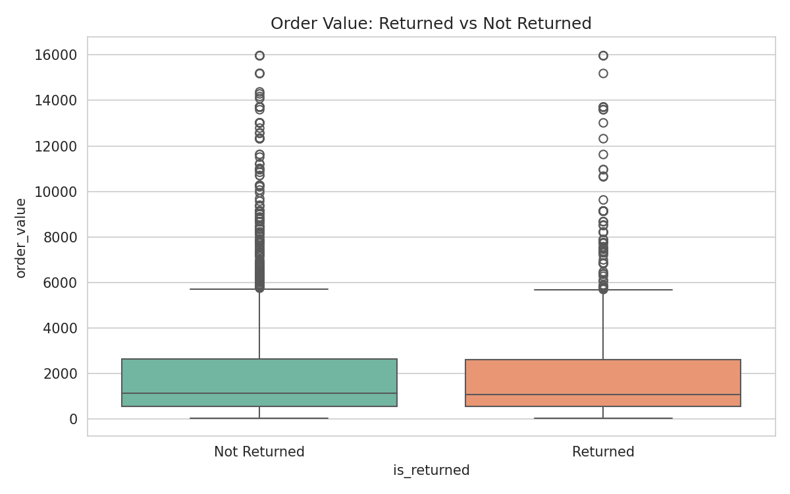
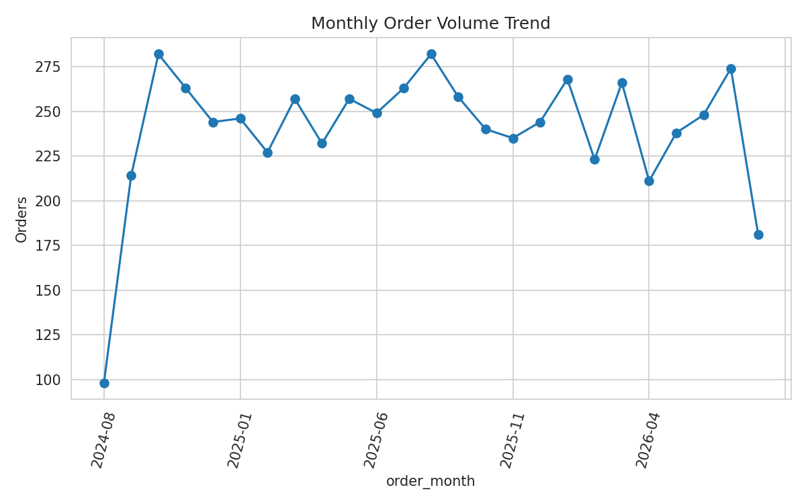
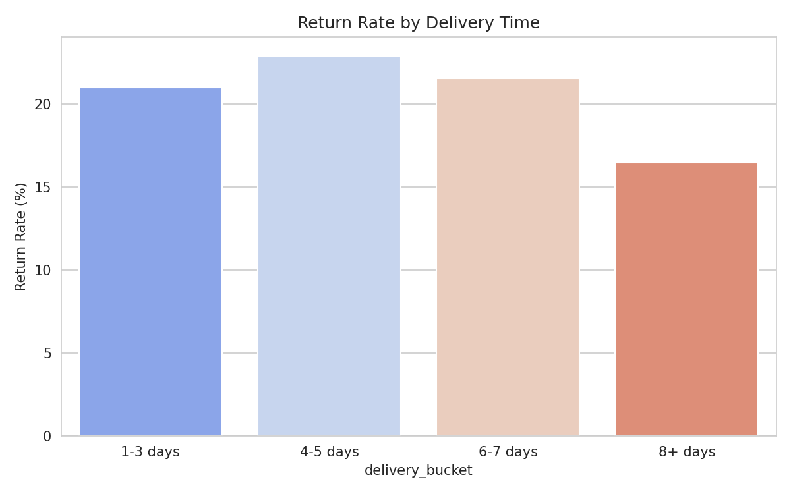
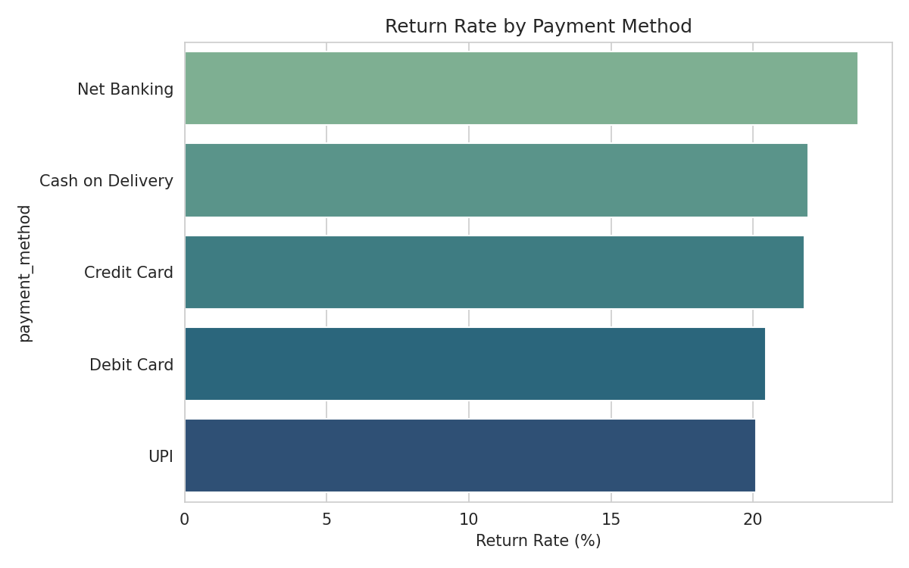
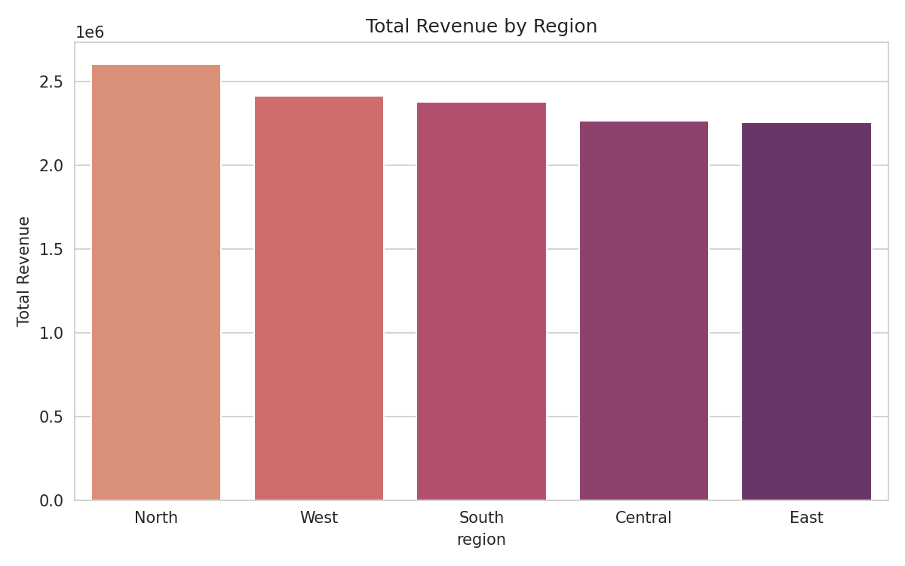
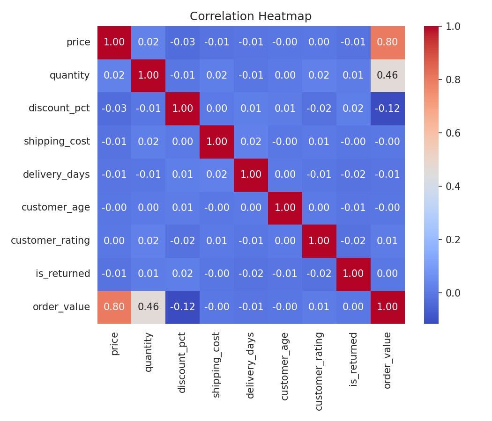

# E-Commerce Returns Analysis Pipeline

A complete data preprocessing and exploratory data analysis (EDA) pipeline built on a messy e-commerce returns dataset. The project covers missing value imputation, duplicate removal, outlier treatment, categorical encoding, feature normalization, EDA, and six business insights derived from the cleaned data.

This was built as **Minor Project 3 (Artificial Intelligence)**, with the goal of understanding how data quality issues (missing values, duplicates, outliers) directly affect downstream machine learning model performance.

## Problem Statement

Raw business data is rarely clean. This project simulates a real-world raw export from an e-commerce returns system, containing:

- Missing values across multiple columns
- Duplicate order records
- Numeric outliers in price, quantity, and delivery time
- Inconsistent category text formatting (mixed casing, whitespace)
- Mixed date formats

The pipeline transforms this raw data into a clean, encoded, ML-ready dataset, then extracts actionable business insights from it.

## Project Structure

```
ecommerce-returns-analysis-pipeline/
│
├── README.md
│
├── Ecommerce_Returns_Analysis_Pipeline.ipynb   # Full Colab-ready pipeline notebook
│
├── data/
│   ├── ecommerce_returns_raw.csv                   # Raw messy dataset
│   ├── ecommerce_returns_cleaned.csv                # Cleaned, human-readable dataset
│   └── ecommerce_returns_encoded.csv                # Encoded + normalized, ML-ready dataset
│
├── charts/
│   ├── insight1_return_rate_category.png
│   ├── insight2_return_reasons.png
│   ├── insight3_order_value_vs_return.png
│   ├── insight4_monthly_trend.png
│   ├── insight5_delivery_vs_return.png
│   ├── insight6_payment_vs_return.png
│   ├── region_revenue.png
│   └── correlation_heatmap.png
│
└── presentation/
    └── Ecommerce_Returns_Insight_Presentation.pptx  # Insight presentation report
```

## Pipeline Steps

| Step | Technique Used | Purpose |
|---|---|---|
| Load raw dataset | pandas `read_csv` | Ingest the raw e-commerce export |
| Clean text and dates | `str.strip()`, `str.title()`, custom date parser | Standardize inconsistent category text and mixed date formats |
| Remove duplicates | `drop_duplicates()` | Prevent duplicate records from biasing the analysis |
| Handle missing values | Median imputation (numeric), mode imputation (categorical) | Fill gaps without distorting distributions |
| Treat outliers | IQR method (clipping) | Cap extreme values instead of discarding valid rows |
| Encode categorical variables | Label Encoding, One-Hot Encoding | Convert text categories into model-ready numeric form |
| Normalize numerical columns | Min-Max Scaling | Bring all numeric features onto a comparable 0-1 scale |
| Exploratory Data Analysis | Histograms, box plots, correlation heatmap | Understand distributions and relationships in the cleaned data |
| Business insights | Grouped aggregations and visualizations | Translate cleaned data into actionable findings |

## Dataset Summary

- 6,150 raw order records reduced to 6,000 clean records after removing 150 duplicates
- Zero missing values remaining after imputation
- Overall return rate: 21.6 percent
- 8 product categories, 5 payment methods, 5 regions

## Business Insights

### 1. Return Rate by Product Category



Books and Toys show the highest return rates among all categories. As lower-cost, often impulse-purchase items, this points toward possible mismatches between product descriptions and customer expectations.

### 2. Top Reasons for Returns



"Wrong Item Delivered" is the single largest driver of returns, followed by "Changed Mind" and "Defective Product." This suggests fulfilment accuracy is a bigger lever for reducing returns than delivery speed or pricing.

### 3. Order Value: Returned vs Not Returned



Median order value is nearly identical between returned and kept orders, indicating that returns are not concentrated among high-value purchases. Return-reduction efforts should be applied catalog-wide rather than targeted at premium items alone.

### 4. Monthly Order Volume Trend



Order volume shows a consistent upward trend across the two-year window, useful for planning warehouse staffing and returns-processing capacity ahead of peak periods.

### 5. Return Rate by Delivery Time



Delivery time has only a mild relationship with return likelihood. Orders delivered in four to five days show a marginally higher return rate, while very fast and very slow deliveries show lower rates. This is not a dominant factor in return behavior.

### 6. Return Rate by Payment Method



Net Banking orders have the highest return rate among all payment methods, while UPI and Debit Card show the lowest. This is worth a closer behavioral review.

### Additional: Revenue by Region



The North region generates the highest total revenue, making it a strong candidate for a dedicated regional fulfilment or marketing focus.

### Additional: Feature Correlation Heatmap



Price and order value are strongly correlated, as expected. No single numeric feature strongly predicts return likelihood, which is why the insights above rely on categorical breakdowns rather than a single numeric driver.

## Tech Stack

- Python 3
- pandas, numpy
- matplotlib, seaborn
- scikit-learn (LabelEncoder, MinMaxScaler)
- Google Colab / Jupyter Notebook

## How to Run

1. Open `notebook/Ecommerce_Returns_Analysis_Pipeline.ipynb` in Google Colab or Jupyter.
2. Run all cells in order (the notebook is self-contained and generates its own raw dataset, so no upload is required).
3. To use your own dataset instead, replace the data-generation cell with:
   ```python
   df = pd.read_csv("your_file.csv")
   ```
4. The cleaned and encoded datasets are exported automatically to `ecommerce_returns_cleaned.csv` and `ecommerce_returns_encoded.csv`.

## Deliverables

- Cleaned dataset (`data/ecommerce_returns_cleaned.csv`)
- EDA notebook (`notebook/Ecommerce_Returns_Analysis_Pipeline.ipynb`)
- Insight presentation report (`presentation/Ecommerce_Returns_Insight_Presentation.pptx`)

## License

This project is intended for academic and educational use.
